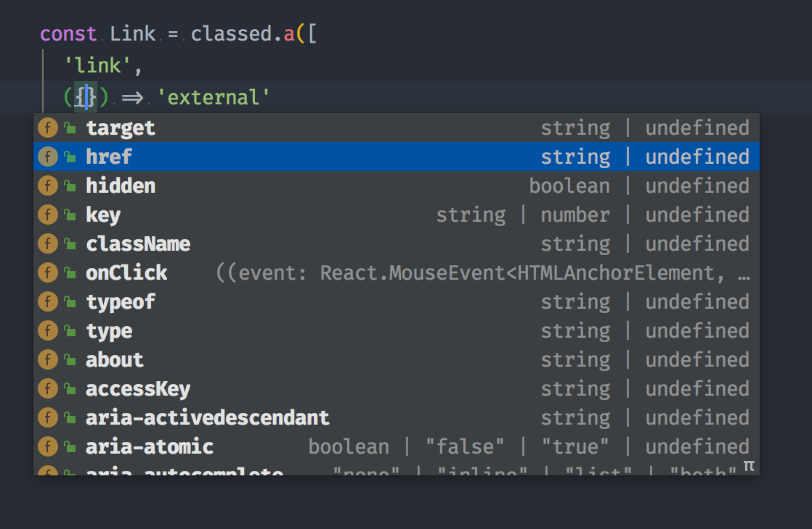
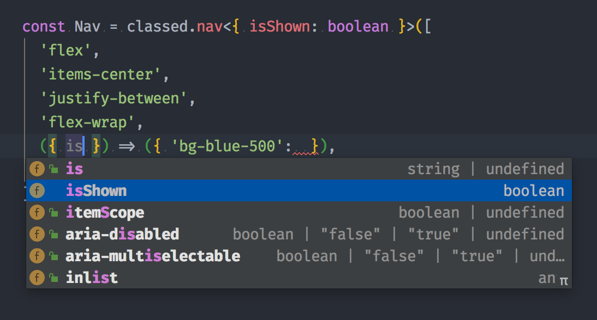
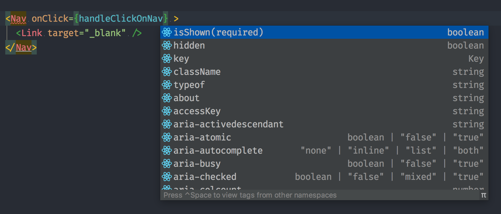

# classed-components <!-- omit in toc -->

[](https://www.npmjs.com/package/classed-components) [](https://www.npmjs.com/package/classed-components)

**💅 CSS Classes for the component age.**

This package allows you to add a your css classes to your component with the power of Javascript, and with Css-in-JS style.


**✨ Features:**

Add you CSS classes in a fluent way to your React components, with:
 - Template string.
 - Array notation.
 - Object notation.

And all of that with:
 - Infinite recursivity,
 - Functions receiving your components props to manage your classes.
 - Top developer experience: deep Typescript typing.

## Table of contents <!-- omit in toc -->
- [Installation](#installation)
- [Usage](#usage)
  - [Object syntax](#object-syntax)
  - [Array Syntax](#array-syntax)
  - [Template string](#template-string)
  - [Functions](#functions)
  - [Nesting](#nesting)
  - [Remaining className prop on classed components](#remaining-classname-prop-on-classed-components)
  - [Typings](#typings)
- [Examples](#examples)
- [A bug, a question?](#a-bug-a-question)
- [License](#license)
- [Contributing](#contributing)
  
------

## Installation

**WIP: NOT RELEASED YET**

<!-- ```bash -->
<!-- yarn add classed-components -->
<!-- ``` -->

## Usage

You can create classed components with the `classed` method exported from `classed-components`, and passing your class to it. There are many way of doing that. We will try to document of all them in this section, but feel free to look at the [tests](./tests/classed.test.tsx) to see all the features and the whole API.


You can create any standard Html `X` classed component by using `classed.X`, `classed[X]` or `classed(X)` method:

```jsx
import classed from 'classed-components'

const Link = classed.a('all my classes')

<Link href="#">foo</Link> // <a href="#" className="all my classes">foo</a>
```

But you can also class any custom component as long it accepts a `className` prop:
```jsx
import classed from 'classed-components'

const BlogLink = ({ className }) => (
  <a className={className} href="https://mathieutu.dev">Blog</a>
)

const MenuLink = classed(BlogLink)('all my classes')

<MenuLink/> // <a className="all my classes" href="https://mathieutu.dev">Blog</a>
```

Several advanced syntaxes are allowed:

### Object syntax

You can pass an object to the method to dynamically toggle classes:

``` jsx
import classed from 'classed-components'
const hasError = true

const Input = classed.input({ 'text-danger': hasError })

<Input/> // <input className="text-danger"/>
```
The above syntax means the presence of the `text-danger` class will be determined by the [truthiness](https://developer.mozilla.org/en-US/docs/Glossary/Truthy) of the constant `hasError`.


### Array Syntax

We can pass an array to the method to apply a list of classes:

``` jsx
import classed from 'classed-components'
const inputClass = 'input'
const errorClass = 'text-danger'

const Input = classed.input([inputClass, errorClass])

<Input/> // <input className="input text-danger"/>
```

If you would like to also toggle a class in the list conditionally, you can do it with a ternary expression:

``` jsx
import classed from 'classed-components'
const hasError = true

const Input = classed.input(['input', hasError ? 'text-danger' : ''])

<Input/> // <input className="input text-danger"/>
```

This will always apply the `input` class, but will only apply `text-danger` when `hasError` is truthy.

However, this can be a bit verbose if you have multiple conditional classes. That's why it's also possible to use the array and object syntax inside array syntax:

``` jsx
import classed from 'classed-components'
const hasError = true

const Input = classed.input(['input', { 'text-danger': hasError }])

<Input/> // <input className="input text-danger"/>
```

### Template string

You can use [tagged template string](https://developer.mozilla.org/en-US/docs/Web/JavaScript/Reference/Template_literals#Tagged_templates) to set your classes:

``` jsx
import classed from 'classed-components'

const Input = classed.input`
  input
  text-danger
`

<Input/> // <input className="input text-danger"/>
```

The placeholders are processed, and allow any type of other syntax:

``` jsx
import classed from 'classed-components'
const hasError = true

const Input = classed.input`
  input
  ${{ 'text-danger': hasError }}
`

<Input/> // <input className="input text-danger"/>
```

### Functions

You can directly pass a function to the method, which will received the props of the component.
The return type of this function can be any of other syntax.

``` jsx
import classed from 'classed-components'

const Input = classed.input(({ hasError }) => ['input', { 'text-danger': hasError }])

<Input hasError/> // <input className="input text-danger"/>
```

Functions can also be used directly nested in arrays and template strings:
``` jsx
import classed from 'classed-components'

const Input = classed.input(['input', ({ hasError }) => { 'text-danger': hasError }])

<Input hasError/> // <input className="input text-danger"/>
```

``` jsx
import classed from 'classed-components'

const Input = classed.input`
  input
  ${({ hasError }) => hasError && 'text-danger'}
  ${({ isRequired }) => isRequired && 'required'}
`

<Input hasError/> // <input className="input text-danger"/>
```

### Nesting

All the syntaxes work together and could be infinetly nested, so this example will work:

``` jsx
import classed from 'classed-components'

const Input = classed.input`
  input
  ${({ hasError, isRequired, errorClass }) => [{ [errorClass]: hasError },  isRequired && 'required']}
`

<Input hasError errorClass="text-danger"/> // <input className="input text-danger"/>
```

### Remaining className prop on classed components

The generated component will keep a `className` prop, and will merge all the classes you will pass through it.
It will so allow you to manage inheritance in your classed components, and compose easily your style.

``` jsx
import classed from 'classed-components'


const BaseInput = classed.input(({ hasError }) => ['input', { 'text-danger': hasError }])
const RequirableInput = classed(BaseInput)(({isRequired}) => ({ 'required': isRequired })

<Input hasError isRequired className="form-contact"/> // <input className="input text-danger required form-contact"/>
```

### Typings

classed-components is highly typed.

When using with Typescript, you will have all the available props of your original component in functions, and in the generated classed component.

If you want to add some props to manage your styling, you can type them by setting the first generic of the function. 

```tsx
const Nav = classed.nav<{ isShown: boolean }>([
  'header',
  ({ isShown }) => ({ 'bg-blue-500': isShown }),
])
```
That way, the original props and the ones you add will be merged, and you will have a high quality auto-completion:







## Examples
Soon: a code sandbox full example.

Here some components styled with [TailwindCss](http://tailwindcss.com/)

```tsx
import { classed } from 'classed-components'
import { Link } from '../Link'

const Nav = classed.nav<{ isShown: boolean }>([
  'flex',
  'items-center',
  'justify-between',
  'flex-wrap',
  ({ isShown }) => ({ 'bg-blue-500': isShown }),
  'p-6',
])

const MenuLink = classed(Link)<{ isBlue: boolean }>`
  block
  mt-4
  lg:inline-block
  lg:mt-0
  text-blue-200
  hover:text-${({ isBlue }) => isBlue ? 'blue-500' : 'white'}
  mr-4
`

const BtnLink = classed(Link)<{ isBlue: boolean }>(({ isBlue }) => {
  const color = isBlue ? 'blue-500' : 'white'

  return [
    'inline-block',
    'text-sm',
    'px-4',
    'py-2',
    'leading-none',
    'border',
    'rounded',
    `text-${color}`,
    `border-${color}`,
    'hover:border-transparent',
    `hover:text-${color}`,
    `hover:bg-${color}`,
    'mt-4',
    'lg:mt-0',
  ]
})
```

## A bug, a question?

Please feel free to [tell me](https://github.com/mathieutu/classed-components/issues/new)!


## License

This package is an open-sourced software licensed under the [MIT license](http://opensource.org/licenses/MIT).


## Contributing

Issues and PRs are obviously welcomed and encouraged, for new features as well as documentation.
